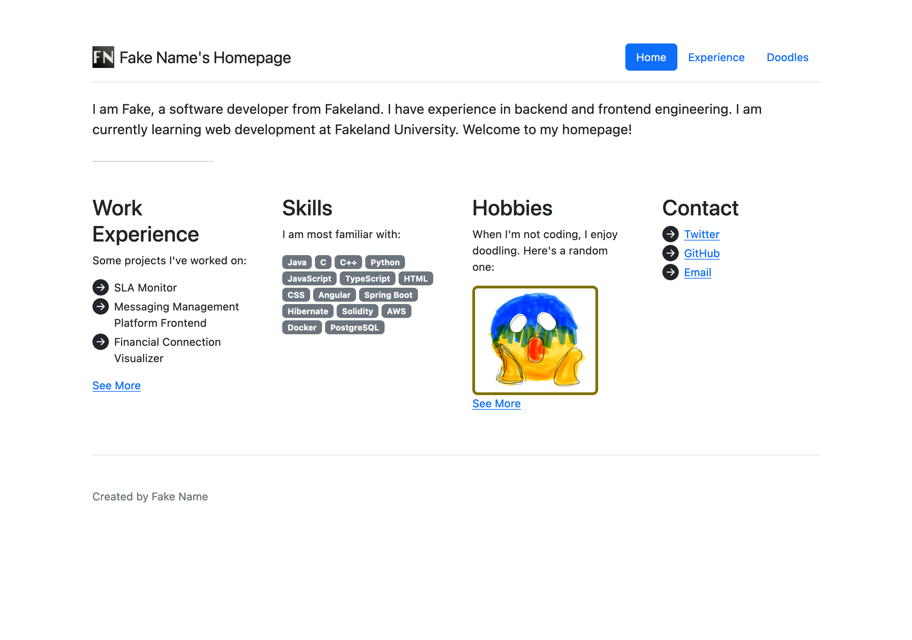
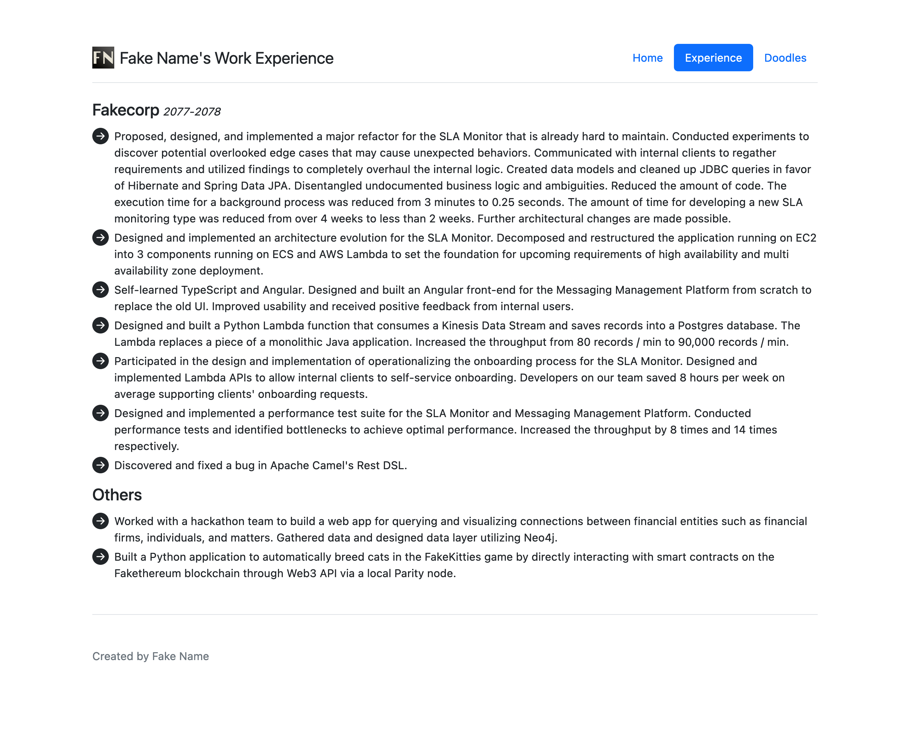
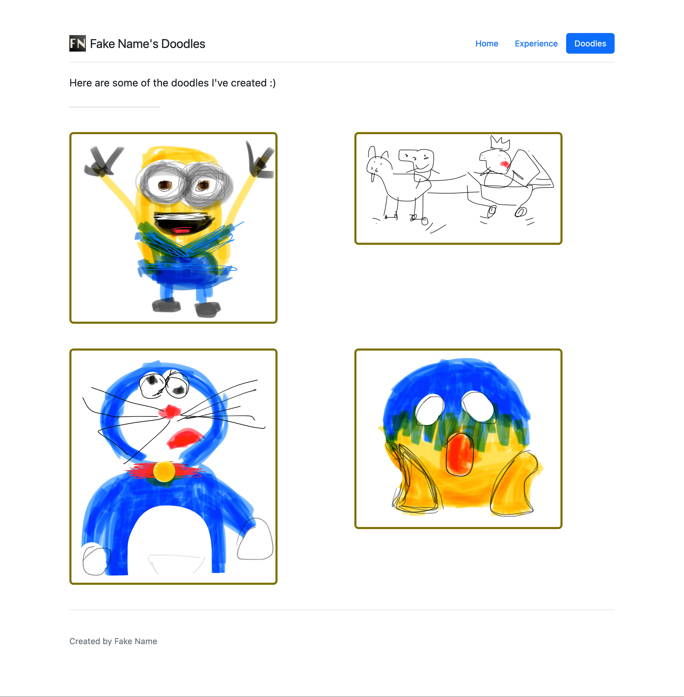

# Fake Name's Homepage

## Project objective

This project is a homepage for Fake Name. It has three pages.

### Home

This is the landing page for the website. It includes a welcome message.
It also has sections for work experience, skills, hobbies and contact
information. The hobby section shows a random doodle every time the page
is loaded.

### Experience

The page includes information about work experience and project experience.

### Doodles

The page shows selected doodle work done by Fake Name.

## Screenshots

## Tech requirements

- node
- npm
- a modern web browser

## How to install / use

### For users

You don't need to install anything to use the project. Just visit it via [this link](https://eqiowtj.github.io/homepage/index.html).

### For developers

- Pull the project from GitHub: `git pull git@github.com:eqiowtj/homepage.git`
- Install dependencies: `npm install`
- Start development server: `npm run start`, the website will be available on `http://localhost:8080/`
- Format code with Prettier: `npm run format`
- Lint JavaScript code with eslint: `npm run lint`

## Class

This project is created as an assignment for the [CS 5610 Web Development](https://johnguerra.co/classes/webDevelopment_fall_2022/) class offered by Northeastern University.

## Video demonstration

A [video demonstration](https://eqiowtj.github.io/homepage/video/demo.mp4) is available.

## Author

[eqiowtj](https://eqiowtj.github.io/homepage/index.html)

## License

This project is distributed under the [MIT License](LICENSE).
